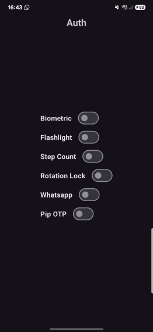

## Mobile Security HW1 
make an app that's uses the phone sensors to limit access to the 
login screen if not all the conditions are met.

## Login Conditions
- The phone's flashlight is on
- The phone's rotation lock is on
- The user archived a certain step count since reboot - configurable with Constants
- Whatsapp (or any other package) is installed - configurable with Constants
- The user opens the app on PIP mode to get an OTP and enter it in the app

## PIP and OTP
- when the user enter pip mode, the app will generate a random OTP and display it.

- the user can enter the OTP in the app to unlock the login screen

### OPT
- generate a random OTP via [`kotlin-onetimepassword`](https://github.com/marcelkliemannel/kotlin-onetimepassword)
- The length of the OTP is configurable with Constants.
- The `OTP secret` can be either manually set or auto-generated - configurable with Constants.

## If all conditions are met
The user can access the login screen.

